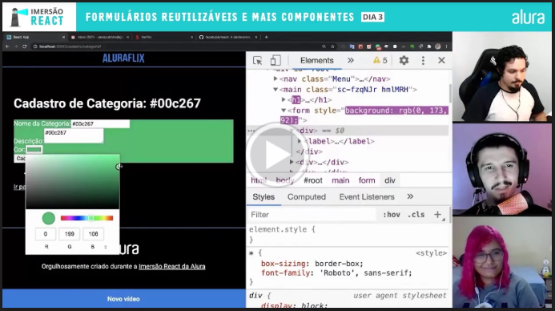

# Aula 3 - Formulários reutilizáveis e mais componentes

---

Nessa aula, nós **vamos entender como trabalhar com elementos dinâmicos na tela da nossa aplicação**.

## Links importantes para você acompanhar

*   [Categoria.js e formulário](https://gist.github.com/omariosouto/e04dd020257ff18fdff307ae2b26e00f)
*   [Código completo da aula 3](https://github.com/omariosouto/lucasflix/tree/live/src)

## Super recados

*   Estamos muito animados com vocês compartilhando o código! Continue mandando pra gente e marcando a Alura.
*   Hoje tem live as 18:30 com o pessoal da Microsoft sobre o tal do TypeScript. Pois é, vamos longe nessa imersão
*   Sim, o curso está ficando mais pesado. Estamos no Discord pra te ajudar.
*   Você tá indo bem? Aproveite pra ensinar alguém. É a forma mais forte de reter conhecimento. No próprio discord você pode fazer a sua própria live
*   O Marco Bruno tem feito live todos os dias no [Twitch dele](https://www.twitch.tv/marcobrunodev)
*   Eu ajudei o Bugan e o Paulo a criar os novos conteúdos de React da Alura! Em breve lançaremos.
