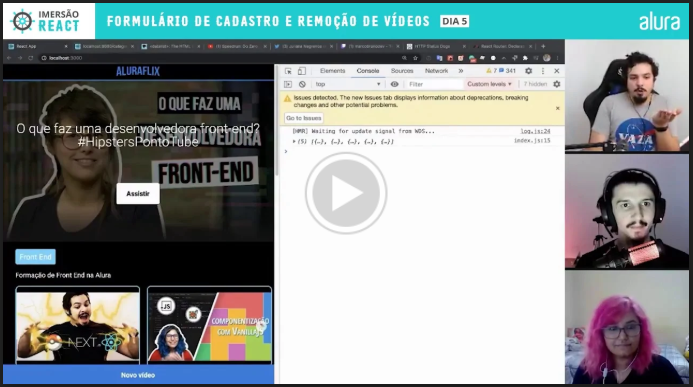

# Aula 5 - Gerenciamento de vídeos com React e JavaScript

---

Pra fechar nosso projeto, **vamos implementar a funcionalidade que tornará possível o cadastro de novos vídeos!** E ver como atualizar a nossa home dinamicamente de acordo com o que for cadastrado :)

## Desafios

*   Implementar a funcionalidade de edição e de exclusão também!

## Conteúdo detalhado dessa aula

*   Cadastro de vídeos
*   Reuso para reuso de lógicas de state
*   Deixando a Home dinâmica
*   Fazendo as categorias aparecerem
*   Cadastrando vídeos

## Links importantes para você acompanhar

*   [Códigos importantes!](https://gist.github.com/omariosouto/710e1627703647c311d511f07a5aa611)
*   [Como fazer validação com React](https://youtu.be/-nYNd6EuZHU)
*   [https://developer.mozilla.org/en-US/docs/Web/HTML/Element/datalist](https://developer.mozilla.org/en-US/docs/Web/HTML/Element/datalist)
*   [Oferta da Alura pra quem quer se aprofundar e ir além do React](https://www.alura.com.br/imersao-react/oferta)

## Aulas e Discord no ar só até a sexta feira que vem!

Teremos um encerramento na terça feira, além de uma competição pelo "melhor" site. Depois a imersão se acaba e espero vê-lo aqui na Alura com a gente, seja na plataforma ou em futuras imersões.

## Mostre seu próprio AluraFlix!

Lembre de usar [esse plugin do Chrome](https://chrome.google.com/webstore/detail/screencastify-screen-vide/mmeijimgabbpbgpdklnllpncmdofkcpn) para gravar o seu site em ação, scrollar e mostrar efeitos especiais. Poste no seu Instagram e Linkedin e não esqueça de marcar #ImersaoReact e @aluraonline para que a gente deixe um comentário e, quem sabe, você apareça nos extras das aulas!